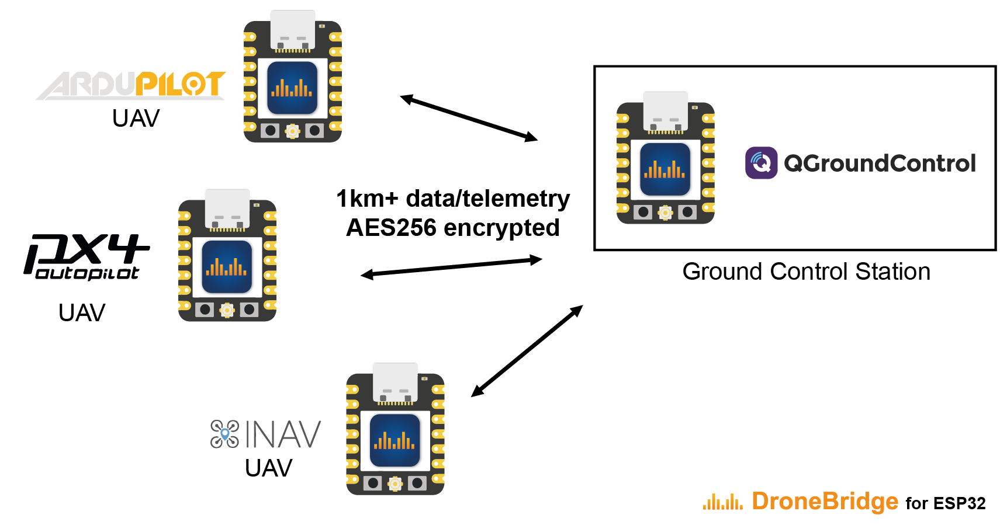
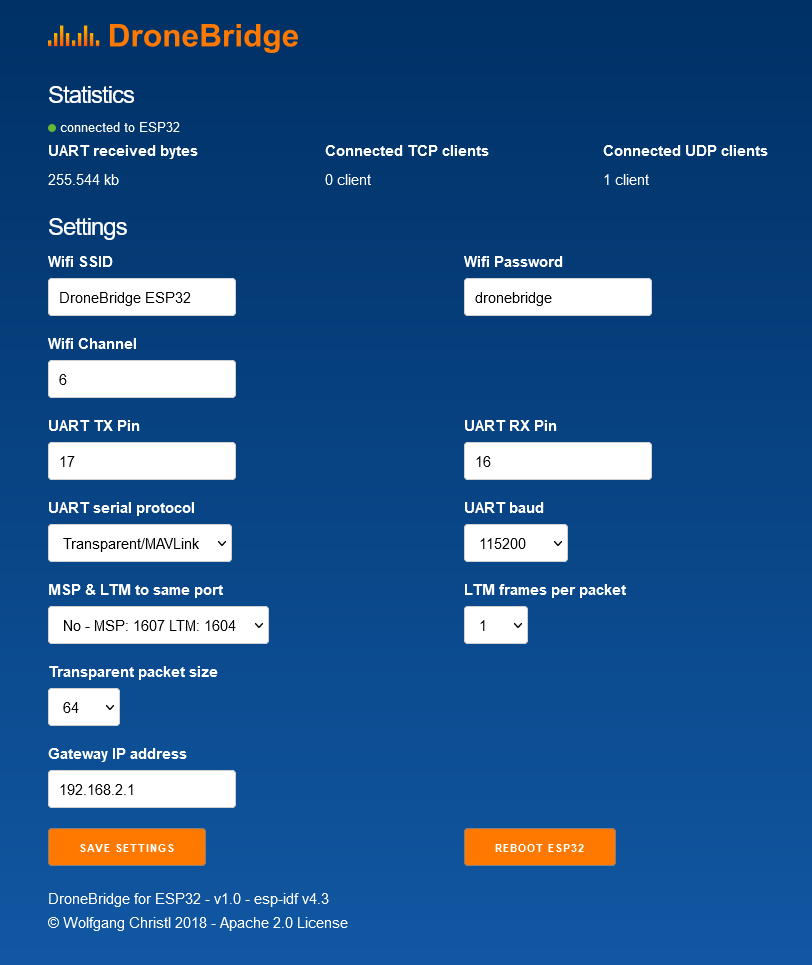

[![Contributors][contributors-shield]][contributors-url]
[![Forks][forks-shield]][forks-url]
[![Stargazers][stars-shield]][stars-url]
[![Issues][issues-shield]][issues-url]

 

   
   <h1>DroneBridge for ESP32</h1>

A firmware for the popular ESP32 modules from Espressif Systems. Probably the cheapest way to
communicate with your drone, UAV, UAS, ground-based vehicle or whatever you may call them.

It also allows for a fully transparent serial to WiFi pass-through link with variable packet size
(Continuous stream of data required).

DroneBridge for ESP32 is a telemetry/low data rate-only solution. There is no support for cameras connected to the ESP32 
since it does not support video encoding.

## Features
-   Bidirectional: serial-to-WiFi, serial-to-WiFi Long-Range (LR), serial-to-ESP-NOW link
-   Support for **MAVLink**, **MSP**, **LTM** or **any other payload** using transparent option
-   Affordable: ~7€
-   Up to **150m range** using standard WiFi
-   Up to **1km of range** using ESP-NOW or Wi-Fi LR Mode - sender & receiver must be ESP32 with LR-Mode enabled
-   **Fully encrypted** in all modes including ESP-NOW broadcasts secured using AES-GCM 256 bit!
-   Weight: <8 g
-   Supported by: QGroundControl, Mission Planner, mwptools, impload etc.
-   Easy to set up: Power connection + UART connection to flight controller
-   Fully configurable through an easy-to-use web interface
-   Parsing of LTM & MSPv2 for more reliable connection and less packet loss
-   Parsing of MAVLink with the injection of Radio Status packets for the display of RSSI in the GCS
-   Fully transparent telemetry down-link option for continuous streams
-   Reliable, low latency

    
    
DroneBridge for ESP32 can be used to control drone swarms at a low cost.

 

DroneBridge for ESP32 supports ESP-NOW LR, enabling ranges of more than 1km with external receiving antennas. The number of drones is only limited by the channel capacity and the ESP32s processing power. All data is encrypted using AES256-GCM.

## Hardware

**Officially supported and tested boards:**  
Do the project and yourself a favour and use one of the officially supported and tested boards below.   
These boards are very low in price, have everything you need and are also very small. Perfect for use on any drone. 

* **[Official board for DroneBridge for ESP32 ebay DE/EU](https://www.ebay.de/itm/116227992460)**  
  **[Official board for DroneBridge for ESP32 ebay EU](https://www.ebay.com/itm/116227992460)**  
  - spares from the second batch, pre-installed and ready for use  
  currently shipping to EU only - contact seller for non-EU shipping options    
  
* **Official board for easy use as ground station coming soon!**

[For further info please check the wiki!](https://dronebridge.gitbook.io/docs/dronebridge-for-esp32/hardware-and-wiring)

## Installation/Flashing using precompiled binaries

[It is recommended that you use the official online flashing tool!](https://dronebridge.github.io/ESP32/install.html)

In any other case there are multiple ways how to flash the firmware.  
**[For further info please check the wiki!](https://dronebridge.gitbook.io/docs/dronebridge-for-esp32/installation)**

## Wiring

1.  Connect the UART of the ESP32 to a 3.3V UART of your flight controller. It is not recommended to use the ESP32s pins that are marked with TX & RX since they often are connected to the internal serial ouput. Go for any other pin instead!
2.  Set the flight controller port to the desired protocol.

**Check out the manufacturer datasheet! Only some modules can take more than 3.3V. Follow the recommendations by the ESP32 board manufacturer for powering the device**  
**[For further info please check the wiki!](https://dronebridge.gitbook.io/docs/dronebridge-for-esp32/hardware-and-wiring)**

## Configuration
1.  Connect to the WiFi `DroneBridge ESP32` with password `dronebridge`
2.  In your browser type: `dronebridge.local` (Chrome: `http://dronebridge.local`) or `192.168.2.1` into the address bar.
 **You might need to disable the cellular connection to force the browser to use the WiFi connection**
3.  Configure as you please and hit `save`

**[For further info please check the wiki!](https://dronebridge.gitbook.io/docs/dronebridge-for-esp32/configuration)**

## Use with QGroundControl, Mission Planner or any other GCS

-   The ESP will auto-send data to all connected devices via UDP to port 14550. QGroundControl should auto-connect using UDP
-   Connect via **TCP on port 5760** or **UDP on port 14550** to the ESP32 to send & receive data with a GCS of your choice. 
-   **In case of a UDP connection the GCS must send at least one packet (e.g. MAVLink heart beat etc.) to the UDP port of the ESP32 to register as an endpoint. Add ESP32 as an UDP target in the GCS**
-   Manually add a UDP target using the web interface

## Further Support & Donations

**If you benefited from this project please consider a donation:** 
-   [PayPal](https://www.paypal.com/donate/?hosted_button_id=SG97392AJN73J)
-   [Buy me a coffee](https://buymeacoffee.com/seeul8er)

For questions or general chatting regarding DroneBridge for ESP32 please visit the Discord channel  

[contributors-shield]: https://img.shields.io/github/contributors/DroneBridge/ESP32.svg?style=for-the-badge
[contributors-url]: https://github.com/DroneBridge/ESP32/graphs/contributors
[forks-shield]: https://img.shields.io/github/forks/DroneBridge/ESP32.svg?style=for-the-badge
[forks-url]: https://github.com/DroneBridge/ESP32/network/members
[stars-shield]: https://img.shields.io/github/stars/DroneBridge/ESP32.svg?style=for-the-badge
[stars-url]: https://github.com/DroneBridge/ESP32/stargazers
[issues-shield]: https://img.shields.io/github/issues/DroneBridge/ESP32.svg?style=for-the-badge
[issues-url]: https://github.com/DroneBridge/ESP32/issues
