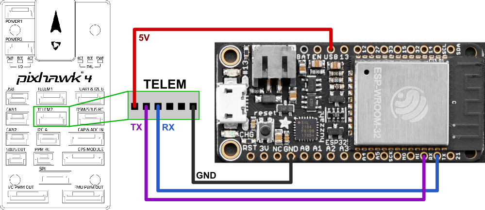

# DroneBridge for ESP32
A DroneBridge enabled firmware for the popular ESP32 modules from Espressif Systems. Probably the cheapest way to
communicate with your drone, UAV, UAS, ground based vehicle or whatever you may call them.

It also allows for a fully transparent serial to WiFi pass through link with variable packet size
(Continuous stream of data required).

DroneBridge for ESP32 is a telemetry/low data rate only solution. There is no support for cameras connected to the ESP32 since it does not support video encoding.


## Features
-   Bi-directional transparent serial to WiFi & ESP-NOW link
-   Support for MAVLink, MSP, LTM or any other payload
-   Affordable: ~7€
-   Up to 150m range using WiFi & (coming up!) up to 1km of range using ESP-NOW (sender & receiver must be ESP32 with LR-Mode enabled [(ESP32 C2 is not supported)](https://docs.espressif.com/projects/esp-idf/en/latest/esp32/api-guides/wifi.html#lr-compatibility))
-   Weight: <10 g
-   Supported by: QGroundControl, DroneBridge for Android (app), mwptools, impload etc.
-   Easy to set up: Power connection + UART connection to flight controller
-   Fully configurable through easy to use web interface
-   Parsing of LTM & MSPv2 for more reliable connection and less packet loss
-   Fully transparent telemetry downlink option for continuous streams like MAVLink or any other protocol
-   Reliable, low latency, light weight
-   Upload mission etc.


Blackbox concept. UDP & TCP connections possible. Automatic UDP uni-cast of messages to port 14550 to all 
connected devices/stations. Allows additional clients to register for UDP. Client must send a packet with length > 0 to UDP port of ESP32.

## Download or Compile

Ready to use binaries for ESP32 via [GitHub releases](https://github.com/DroneBridge/ESP32/releases).  
Or compile using esp-idf v5.1:
-   ESP32   `idf.py set-target esp32 build`
-   ESP32S2 `idf.py set-target esp32s2 build`
-   ESP32S3 `idf.py set-target esp32s3 build`
-   ESP32C3 `idf.py set-target esp32c3 build`

## Hardware

**Officially supported and tested boards:**  
Do the project and yourself a favour and use one of the officially supported and tested boards below.   
These boards are very low in price, have everything you need and are also very small. Perfect for use on any drone.   
The sponsored links below help dedicate more resources to the project.
* [Seeed Studio XIAO ESP32C3](https://www.seeedstudio.com/Seeed-XIAO-ESP32C3-p-5431.html?sensecap_affiliate=JboL6N1&referring_service=link) + [External antenna](https://www.seeedstudio.com/2-4GHz-2-81dBi-Antenna-for-XIAO-ESP32C3-p-5475.html?sensecap_affiliate=JboL6N1&referring_service=link) for more range.

Other non-tested boards that will likely work:
* AZDelivery DevKit C
* ESP32-C3-DevKitM-1
* TinyPICO - ESP32 Development Board - V2
* Adafruit HUZZAH32 – ESP32 Feather Board

Other ESP boards are very likely to work as well. No additional PSRAM is required. You will need a USB to serial adapter for flashing the firmware if your ESP32 board does not come with one. Follow the instructions of the board manufacturer when it comes to wiring the power supply lines. Some modules do not like an external 5V power input connected in addition to a USB at the same time.

## Installation/Flashing using precompiled binaries

First download the latest release from this repository.
[You can find them here](https://github.com/DroneBridge/ESP32/releases).

There are many multiple ways on how to flash the firmware. The easy ones are explained below.

**Erase the flash before flashing a new release!**

#### All platforms: Use Espressif firmware flashing tool

#### Recommended

1.  [Download the esp-idf for windows](https://docs.espressif.com/projects/esp-idf/en/release-v4.3/esp32/get-started/windows-setup.html#get-started-windows-tools-installer) or [linux](https://docs.espressif.com/projects/esp-idf/en/release-v4.3/esp32/get-started/linux-setup.html) or install via `pip install esptool`
2.  Connect via USB/Serial. Find out the serial port via `dmesg` on linux or using the device manager on windows.
  In this example the serial connection to the ESP32 is on `COM4` (in Linux e.g. `/dev/ttyUSB0`).
3. `esptool.py -p COM4 erase_flash`
4. ```shell
   esptool.py -p COM4 -b 460800 --before default_reset --after hard_reset  write_flash --flash_mode dio --flash_size detect --flash_freq 40m 0x1000 bootloader.bin 0x8000 partition-table.bin 0x10000 db_esp32.bin 0x110000 www.bin
   ```
   You might need to press the boot button on your ESP to start the upload/flash process.

[Look here for more detailed information](https://github.com/espressif/esptool)

#### Windows only: Use flash download tools

1. [Get it here](https://www.espressif.com/en/support/download/other-tools?5)
2. Erase the flash of the ESP32 befor flashing a new release\
   
3. Select the firmware, bootloader & partition table and set everything as below
   ```shell
    0x8000 partition_table/partition-table.bin
    0x1000 bootloader/bootloader.bin
    0x10000 db_esp32.bin
    0x110000 www.bin
   ```
   
3.  Hit Start and power cycle your ESP32 after flashing

### Wiring

1.  Connect the UART of the ESP32 to a 3.3V UART of your flight controller. It is not recommended to use the ESP32s pins that are marked with TX & RX since they often are connected to the internal serial ouput. Go for any other pin instead!
2.  Set the flight controller port to the desired protocol.

**Check out manufacturer datasheet! Only some modules can take more than 3.3V. Follow the recommendations by the ESP32 boards manufacturer for powering the device**




### Configuration
1.  Connect to the wifi `DroneBridge ESP32` with password `dronebridge`
2.  In your browser type: `dronebridge.local` (Chrome: `http://dronebridge.local`) or `192.168.2.1` into the address bar.
 **You might need to disable the cellular connection to force the browser to use the WiFi connection**
3.  Configure as you please and hit `save`


**Configuration Options:**
-   `ESP32 Mode`
    -   `Access Point Mode`  
    ESP32 will create a Wi-Fi Access Point to which other ground control stations can connect to
    -   `WiFi Client Mode`  
    ESP32 will connect to the specified WiFi Access Point. After 50 failed connection retries (~60 seconds) the ESP32 will temporarily switch to WiFi Access Point Mode with SSID `Failsafe DroneBridge ESP32` and password `dronebridge`. This mode allows you to check and change the configuration. On reboot the stored configuration will be loaded.  
                            In this mode the ESP32 can connect to WiFi and ESP-NOW (LR-Mode) devices.
    -   `(In future release) ESP-NOW Access Point Mode`   
    Launches an access point that is ESP-NOW enabled. ESP-NOW Access Point Mode makes the device invisible for non-ESP-NOW enabled devices. You will not be able to change the config!  
        You will have to manually erase the flash memory of the ESP32 and re-flash DroneBridge for ESP32 to get back into normal Wi-Fi Mode!
-   `Wifi SSID`: Up to 31 character long
-   `Wifi password`: Min. 8 characters, max 63 character long. WiFi must be at least WEP encrypted. No support for unencrypted networks!
-   `UART baud rate`: Same as you configured on your flight controller
-   `GPIO TX PIN Number` & `GPIO RX PIN Number`: The pins you want to use for TX & RX (UART). See pin out of manufacturer of your ESP32 device **Flight controller UART must be 3.3V or use an inverter.** If pins are the same for TX & RX the UART connection will not be established.
-   `UART serial protocol`: MultiWii based or MAVLink based - configures the parser
-   `Transparent packet size`: Only used with 'serial protocol' set to transparent. Length of UDP packets in transparent mode. **ESP-NOW only supports packets <250bytes**
-   `LTM frames per packet`: Buffer the specified number of packets and send them at once in one packet
-   `Gateway IP address`: IPv4 address you want the ESP32 access point to have

Most options require a restart/reset of ESP32 module

## Use with DroneBridge for Android or QGroundControl


-   Use the Android app to display live telemetry data. Mission planning capabilities for MAVLink will follow.
-   The ESP will auto broadcast messages to all connected devices via UDP to port 14550. QGroundControl should auto connect
-   Connect via **TCP on port 5760** or **UDP on port 14550** to the ESP32 to send & receive data with a GCS of your choice. **In case of a UDP connection the GCS must send at least one packet (e.g. MAVLink heart beat etc.) to the UDP port of the ESP32 to register as an end point.**

## Developers

### Compile
 You will need the Espressif SDK: esp-idf + toolchain. Check out their website for more info and on how to set it up.
 The code is written in pure C using the esp-idf (no arduino libs).

 **This project supports the v5.1.2 of ESP-IDF**

Added mDNS via `idf.py add-dependency "espressif/mdns^1.2.2"`
 Compile and flash by running: `idf.py build`, `idf.py flash`

 ### API
The webinterface communicates with a REST:API on the ESP32. You can use that API to set configurations not selectable 
via the web-interface (e.g. baud rate). It also allows you to easily integrate DroneBridge for ESP32.


**To request the settings**
```http request
http://dronebridge.local/api/settings/request
```

**To request stats**
```http request
http://dronebridge.local/api/system/stats
```

**To request IP and port of active UDP connections**
```http request
http://dronebridge.local/api/system/conns
```

**Trigger a reboot**
```http request
http://dronebridge.local/api/system/reboot
```

**Trigger a settings change:** Send a valid JSON
```json
{
  "esp32_mode": 1,
  "wifi_ssid": "DroneBridge ESP32",
  "wifi_pass": "dronebridge",
  "ap_channel": 6,
  "tx_pin": 17,
  "rx_pin": 16,
  "telem_proto": 4,
  "baud": 115200,
  "msp_ltm_port": 0,
  "ltm_pp": 2,
  "trans_pack_size": 64,
  "ap_ip": "192.168.2.1"
}
```
to
```http request
http://dronebridge.local/api/settings/change
```

 ### Testing
 To test the frontend without the ESP32 run 

 ```sh
 npm install -g json-server
 json-server db.json --routes routes.json
 ```
Set `const ROOT_URL = "http://localhost:3000/"` inside `index.html` and the `<script>` block
